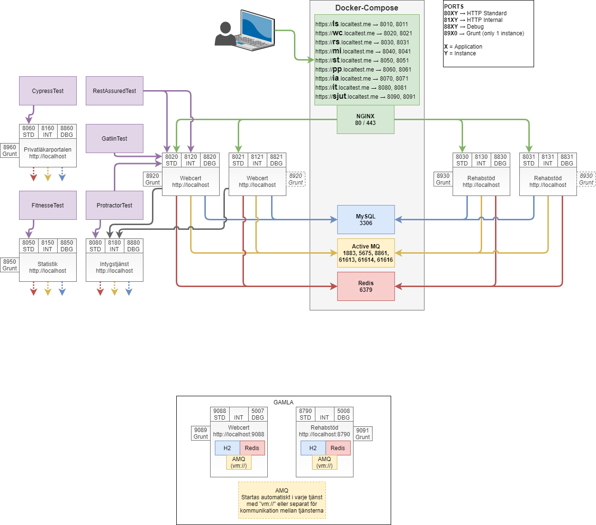

# Development Environment
The intent of this document is to give a common description of the development environment for Intygstjänster. Note that not all part of this document is relevant for all applications. An example of this is which tests are runnable for an application. 

# Prerequisites for development environment
Intygstjänster uses four underlying services (infrastructure) for it's applications, and these are provided by docker compose in the development environment.
Therefore docker needs to be installed on the development computer to be able to run the applications.

The infrastructure services are:

| Type | Application |
|------|-------------|
| Database | MySQL |
| Cache | Redis |
| JMS | ActiveMQ |
| Loadbalancer/TLS-termination | NGINX | 


## Linux
On Linux this will work fine "out-of-the-box".

## Windows
Windows users are recommended to use Docker with `WSL2` as the backing engine. (Not Hyper-V).

To use WSL2 on Windows 10 you will need at least the 20H1 (2004) update, or a minor build number 1049 or higher on Windows builds 18362 or 18363.

Check your version by pressing `Win` and type `winver` followed by `enter`.
Check the `OS Build` information.
Ex: _(OS Build 18363.1139)_ is a valid version.

Once one of these versions are installed, `WSL2` can be installed or upgraded from the first `WSL` version.

* https://docs.microsoft.com/en-us/windows/wsl/install-win10
    * `Ubuntu` is the recommended linux distribution

The next step is to install Docker Desktop (Stable version). Choose WSL2 as engine and skip Hyper-V.

* https://docs.docker.com/docker-for-windows/install/

## What's included
The docker compose script in the `docker-compose` directory includes the following infrastructure applications:

| Service | Exposes ports |
|---|---|
| MySQL | 3306 |
| Redis | 6379 |
| ActiveMQ | 1883, 5675, 8861, 61613, 61614, 61616 |
| NGINX | 80, 443 | 

# Usage
This repository (devops) must be checked out with the correct branch (as of now `release/2021-1`).

Use a console of your choice (Bash, PowerShell, Ubuntu in WSL2, Git Bash etc.) and go to the directory `docker-compose`. Then use the following commands to start the containers (this will take a few minutes the first time, since the images needs to download to your computer):

* `docker-compose up -d` (start as daemon)
* `docker-compose up` (will lock console and use it to print container logs)

_**Note:** Windows sends a warning if the docker-compose directory, is mounted on the Windows filesystem but this can be ignored for now._

## Use-cases
Data stored in the infrastructure services are persistent between restarts of the Intygstjänster applications. This is very useful since changes can be made to the applications without losing the test-data you created. There are however cases when you want your data to be reset.

### Keep data
Data is kept in the docker containers in the following cases:
* Do nothing with docker and just restart your Intygstjänster services.
* Stop the infrastructure services by either
    * pressing `ctrl+c` if started without daemon
    * typing `docker-compose stop` if started with daemon
    * Using the docker desktop interface to stop the services
* Restarting the containers which can be done in several ways, i.e. `docker-compose restart`
* Restarting the computer

### Clear data
Data is cleared from the containers when they are removed from docker-compose. This can be done by:
* typing `docker-compose down`
* Using the docker desktop interface to remove the containers


## ActiveMQ GUI
The Active MQ container includes an administration GUI that can be used to browse and manage queues.
 
https://amq.localtest.me/admin (admin/admin)

## Credentials
The infrastructure services are password protected, and to access them via Web-GUI (AMQ) or application (MySQL Workbench, Readily) to view their data, you will need to login. The credentials for the services can be found in the `docker-compose.yaml` file.


# Intygstjänster applications
The applications in Intygstjänster uses the same convention for a lot of their configuration. This section describes their common configuration and usage.

## Ports
Ports are assigned to each of the applications according to the following pattern where:
* **X** - represents an application
* **Y** - represents an instance of that application

| PORT | Usage |
|---|---|
| 80XY | HTTP Standard |
| 81XY | HTTP Internal |
| 88XY | Debug |
| 89X0 | Grunt or other frontend proxy |

This translates to the following concrete ports for each of the applications (ports for instance 2 in parentheses):

| Application | HTTP standard | HTTP Internal | Debug | "Grunt" |
|---|---|---|---|---|
| Logsender | 8010 <br> _(8011)_ | 8110 <br> _(8111)_ | 8810 <br> _(8811)_ | N/A |
| Webcert | 8020 <br> _(8021)_ | 8120 <br> _(8121)_ | 8820 <br> _(8821)_ | 8920 |
| Rehabstöd | 8030 <br> _(8031)_ | 8130 <br> _(8131)_ | 8830 <br> _(8831)_ | 8930 |
| Mina Intyg | 8040 <br> _(8041)_ | 8140 <br> _(8141)_ | 8840 <br> _(8841)_ | 8940 |
| Statistik | 8050 <br> _(8051)_ | 8150 <br> _(8151)_ | 8850 <br> _(8851)_ | 8950 |
| Privatläkarportal | 8060 <br> _(8061)_ | 8160 <br> _(8161)_ | 8860 <br> _(8861)_ | 8960 |
| Intygsadmin | 8070 <br> _(8071)_ | 8170 <br> _(8171)_ | 8870 <br> _(8871)_ | 8970 |
| Intygstjänst | 8080 <br> _(8081)_ | 8180 <br> _(8181)_ | 8880 <br> _(8881)_ | N/A |

## Building an application
All applications are built using the gradle-wrapper included in the repository. To build an application simple use
```
gradlew build
```
Some common options when building an application:

| Build command | Description |
|---|---|
| `gradlew build` | Builds the application an runs all unit tests |
| `gradlew build -x test` | Builds the application but skips unit tests |
| `gradlew build -P codeQuality` | Builds the application and checks code compliance (use with `-x test` to skip tests) |
| `gradlew licenseFormat -P codeQuality` | Adds License header in .java, .kt, .groovy, .js files if they're missing | 

## Starting an application
To run an application use
```
gradlew appRun
```

> Spring Boot applications, i.e. IntygsAdmin has an extra profile that should be used when you don't want, or need, to run the frontend proxy.
>
>```
>gradlew appRun -P client
>```

> AngularJS applications can be run with its client code in a minified state (as is done in production).
>
>```
>gradlew appRun -P useMinifiedJavaScript
>```

### Additional instance
All applications have the ability to be started with two instances. Even more instances can be added, but requires extra configuration in the application itself. If you need this ability then study the code and figure it out.

To start the additional instance simply add `-Dinstance=1`. This will add 1 to all applicable ports before starting the application. Running the applications without `-Dinstance=` is the same as using `-Dinstance=0`. 

Standard instance
```
gradlew appRun
```
or for the person who likes to type alot
```
gradlew appRun -Dinstance=0
```
Additional instance
```
gradlew appRun -Dinstance=1
``` 

## Accessing an application
All applications can be accessed in three different ways:
1. With HTTPS or HTTP on standard 80/443 ports through the NGINX included in Docker Compose
2. With HTTP on the actual application port, i.e. 80XY
3. Through the frontend proxy (when started)

When to use each of these options are use-case dependent.

Since some configuration in the applications are "hardcoded", the use of different options may require configuration changes to work properly.

### Option 1
The preferred way is option 1, since this will allow you to use multiple applications at the same time without them stealing each others sessions, and it also eliminates problems with same-site attributes (when used with HTTPS). It also allows for actual SAML-login since these hosts are registered in the Inera IdP for development (idp.ineradev.org).

Just start your application and access it with:

| Application | URL | Fakelogin | 
|---|---|---|
| Webcert | https://wc.localtest.me | https://wc.localtest.me/welcome.html |
| Rehabstöd | https://rs.localtest.me | https://rs.localtest.me/welcome.html |
| Mina Intyg | https://mi.localtest.me | https://mi.localtest.me/welcome.html |
| Statistik | https://st.localtest.me | https://st.localtest.me/#/fakelogin |
| Privatläkarportal | https://pp.localtest.me | https://pp.localtest.me/welcome.html |
| Intygsadmin | https://ia.localtest.me | https://ia.localtest.me/welcome.html |

### Option 2 
This option will skip the NGINX and address the application directly through it's standard port. This is how the tests accesses the applications when run. This option can used in two ways. Either by using localhost, or by using the applications localhost alias. Webcert example below, but see the ports section for all the other application ports.

| Application | URL | Alt. URL |
|---|---|---|
| Webcert | http://localhost:8020 | http://wc.localtest.me:8020 |

### Option 3
This option is most commonly used when working on the frontend code, since this will allow for "Live-reload" of the changes made in the GUI. Since this is the use-case, there is no need to run this option as multiple instances, and therefore only one frontend proxy per application can be run at once. That is why the table in section ports only specify one port per application for this proxy. The proxy first has to be started. See section "Frontend proxy" further down.

Once started the application can be accessed via it's proxy. Webcert example below, but see the ports section for all the other application ports.

| Application | URL | Alt. URL |
|---|---|---|
| Webcert | http://localhost:8920 | http://wc.localtest.me:8920 |

## Debugging
This is done by starting the application with a slightly modfied command. Instead of `appRun`, use
```
gradlew appRunDebug
```
See the ports section of this document for application specific debug port information.

Debug mode can also be used with multiple instances whith the addition of `-Dinstance=1` for the additional instance.
```
gradlew appRunDebug -Dinstance=1
``` 

## Frontend Proxy
Each application (with a GUI) has the ability to run a frontend proxy to accommodate "Live-reload" of GUI changes. This is done by first starting the application as described in "Starting an Application". Note that the use-case for running a frontend proxy is to work on frontend code, so the need for multiple instances are zero, and therefore only one instance of the frontend proxy can run.

When the application has started the proxy is started by the following command(s):

#### AngularJS based applications
```
cd web
grunt serve
```

#### React based applications
```
cd web/client
npm install (first time only)
npm start
```

## Running tests
This section describes, in a generic way, how to run different kind of tests within Intygstjänster. Note that not all tests are applicable for all applications, but when a test of a certain type is present in an application, then this section can be used as guidance.

The tests all run against the application standard and internal port. Not the via the frontend proxy. If that use-case is needed then this can easily be acheived via changes to the configuration file for the test. This will also create the need to start the frontend proxy before the test is run.

See the illustration section for an overview of how the tests relates to, and uses, different ports.

> All commands specified below are run from the project-root, and require the application to be started as the primary instance.

> Applications marked with (*) requires that Intygstjänst is started as well.
 
### RestAssured
_Intygsadmin | Intygstjanst | Mina Intyg* | Privatläkarportal | Rehabstöd | Webcert*_
```
# All tests
gradlew restAssured

# Log to standard out
gradlew restAssured -info

# All tests in a given packet
gradlew restAssured --tests se.inera.intyg.webcert.web.integration.integrationtest.*

# All tests in a given class
gradlew restAssured --tests *ApiControllerIT

# Specific test in a class
gradlew restAssured --tests *ApiControllerIT.testArchive
```

### Protractor
_Webcert* | Mina Intyg* | Rehabstöd | Statistik_
```
gradlew protractorTest
```

Protractor has the ability to run or skip individual tests. This is done by editing the test specification (*.spec.js). If you want to run a specific test edit the file and change `describe` to `fdescribe`.

To skip a test change `describe` to `xdescribe`.

Both of these changes can be made at individual steps in the test, or at the start definition. 

> Be extra careful not to push any `fdescribe` to the repository since this will stop all other testcases to run in our pipelines. 

### Cypress
_Intygsadmin | Privatläkarportalen_
```
gradlew cypressTest
```

An alternative is to start the tests (or Cypress console) via `npm`.

With Cypress console:
```
cd test
npm start
```

Headless (equal to the `gradlew` option):
```
cd test
npm test
```


### Fitnesse
_Statistik_
```
gradlew fitnesseTest

# alt.
gradlew fitnesseWiki
```
In wiki mode, a webserver starts at http://localhost:9125/StatisticsTests

### IntegrationTest
_Statistik_

This test does not require the application to be running
```
gradlew integrationTest
```

### CamelTest
_Webcert_

This test does not require the application to be running
```
gradlew camelTest
```

## Illustration
The following image illustrates how the applications and tests uses the different ports. Not all applications are represented in this image, but every type of service and tests are, so the principles shown applies to all applications.



## SAML-login
TODO: Describe the common practices of SAML login with Inera IdP. How to setup metadata and which applications that needs to be installed.